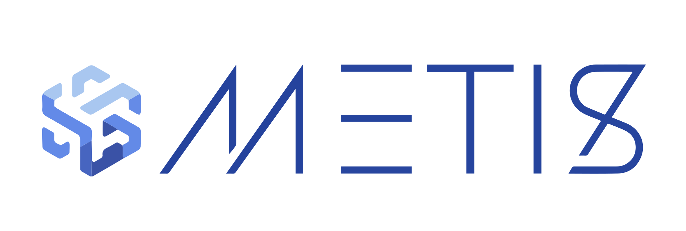

# Metis

<p align="center">
  
</p>
<center>
<b>METIS: Modular Environment for Training Intelligent Systems</b>
</center>

<p align="center">
  Made by Prof. Federico Fausto Santoro of ARSLab of University of Catania 
</p>
<p align="center">
  Powered by Godot Engine, Gymnasium, Keras/TensorFlow, and optional Stable-Baselines3
</p>

Metis connects Godot simulations to reinforcement-learning code written with
Gymnasium and TensorFlow/Keras. Agents, sensors, rewards, episode rules, and world
physics live in Godot. Python reads that contract and handles data collection,
optimization, checkpoints, evaluation, and inference.

**The aim is straightforward: changing the task should usually mean building a new
Godot scene, not writing another Python training program.**

Metis is under active development, but it already supports discrete, continuous, and
hybrid control; multi-agent environments; asynchronous collection; demonstrations;
self-play; and portable policy exports.

Start with the [documentation index](docs/README.md). If you are building a task for
the first time, read [Build a new agent and scenario](docs/tutorials/new-agent-and-scenario.md).

## What is included

| Area | Current support |
|---|---|
| Simulation | Godot 4, 2D and 3D scenes, physics, seeded resets |
| Environment API | Generic Gymnasium wrapper and newline-delimited JSON over TCP |
| Action spaces | Discrete, continuous, multi-discrete, and hybrid |
| Observations | Methods, properties, body state, ray casts, targets, teams, and paths |
| Rewards | Per-agent components and scenario-level components |
| Training backends | Native Metis trainers by default; limited SB3 comparison adapter |
| Algorithms | DQN, PPO, DDPG, DDPG+BC, DDPGfD, TD3, TD3+BC, and SAC |
| Collection | One or more Godot processes, synchronous or asynchronous |
| Multi-agent | Separate transitions with parameter sharing |
| Competition | Simultaneous self-play and historical opponent pools |
| Demonstrations | Manual recording, replay prefill, and behavior cloning |
| Persistence | Full checkpoints, replay snapshots, best-policy tracking, Keras bundles |
| Monitoring | Persistent health state, alerts, and an optional live dashboard |
| Recovery | Opt-in rollback to a validated best policy with guarded learning-rate reduction |
| Inference | Reproducible lockstep or real-time execution |
| Export | Keras, TensorFlow Lite, and optional ONNX |
| Platforms | Linux CPU/CUDA and Apple Silicon with TensorFlow Metal |

Metis ships its own TensorFlow/Keras trainers and uses them by default.
Stable-Baselines3 compatibility is optional and deliberately limited: the adapter
exists primarily to compare Metis algorithms with established PyTorch
implementations while keeping the same Godot scene contract. It is not intended to
replace the native backend or imply feature parity.

## How the pieces fit

Godot owns the simulation:

- bodies, collision shapes, physics, and game rules;
- sensors and observations;
- action-space declarations;
- rewards, progress, events, and terminal conditions;
- reset randomization and task curriculum.

Python owns learning and orchestration:

- starting and stopping Godot processes;
- exposing each process as a Gymnasium environment;
- collecting replay or rollout data;
- updating Keras models, or an optional Stable-Baselines3 model;
- saving, evaluating, and running policies.

`BridgeServer` sits between them. Godot acts as the server because it owns the
authoritative world state. Python connects as a client and decides when the world
should reset or advance.

```text
metis train
(or python/train.py in a source checkout)
    |
    +-- GodotProcessManager -> one or more Godot processes
    +-- ScenarioGymEnv      -> Gymnasium interface
    +-- algorithms/*        -> native Keras learner
    +-- backends/sb3.py     -> optional SB3/PyTorch learner
                                |
Godot                           |
    BridgeServer <--------------+
        ScenarioController
            Agent[]
            ScenarioEventSystem
            ScenarioRewardSystem
            ProgressProvider
```

The protocol exposes four operations: `spec`, `configure`, `reset`, and `step`.
`TCP_NODELAY` is enabled to avoid adding latency to the many small messages exchanged
during training.

## Installation

The project is tested with Godot 4.7. Nearby Godot 4 releases may work, but they are not part of the regular test setup. You can download it from official web page https://godotengine.org/

### Godot Asset Library release

Copy `addons/metis` from the release into your project and enable **Metis** in
**Project > Project Settings > Plugins**. The packaged add-on offers to create an
isolated Python runtime in `res://.metis/venv`; the same setup is available later from
**Tools > Metis Runtime Setup...**. It never modifies system Python or installs
dependencies without confirmation. Release files are checksum-verified before
installation, and the runtime is accepted only after its Python version, Metis
version, dependencies, Godot executable, and requested accelerator have been
validated.

Once configured, use `.metis/venv/bin/metis` on Linux/macOS or
`.metis\venv\Scripts\metis.exe` on Windows. See
[Distribution and installation](docs/reference/distribution.md) for profiles,
existing environments, and release contents.

### Source checkout

Create the virtual environment from the repository root:

```bash
python3 -m venv python/.venv
python/.venv/bin/python -m pip install --upgrade pip
python/.venv/bin/python -m pip install -r python/requirements.txt
```

For NVIDIA CUDA on Linux:

```bash
python/.venv/bin/python -m pip install -r python/requirements-linux-cuda.txt
```

For Apple Silicon:

```bash
xcode-select --install
python/.venv/bin/python -m pip install -r python/requirements-macos-metal.txt
```

The macOS requirements intentionally pin `tensorflow==2.18.1` and
`tensorflow-metal==1.2.0`. That Metal plugin does not match the ABI of newer
TensorFlow releases.

The live dashboard is optional. Install its small web stack only on machines where it
will be used:

```bash
python/.venv/bin/python -m pip install -r python/requirements-dashboard.txt
```

Stable-Baselines3 is an optional backend in the same Metis runtime:

```bash
python/.venv/bin/python -m pip install -r python/requirements-sb3.txt
```

For tightly controlled backend benchmarks, a separate `.venv-sb3` remains useful to
isolate PyTorch from TensorFlow, but it is not required by Metis.

Set `GODOT_BIN` if Godot is not on `PATH`:

```bash
export GODOT_BIN=/path/to/Godot
```

Installing the source tree in editable mode also exposes the CLI:

```bash
python/.venv/bin/python -m pip install -e python --no-deps
python/.venv/bin/metis doctor --godot-bin "$GODOT_BIN"
```

The direct `python/train.py`, `python/run.py`, `python/recorder.py`, and
`python/export.py` commands remain supported for repository development.

## A first run

Before training, use a random rollout to check the scene contract and reset behavior:

```bash
python/.venv/bin/python python/tools/random_rollout.py \
  --godot-project godot \
  --godot-scene res://scenarios/pong/pong_scenario.tscn \
  --multi-agent \
  --steps 300 \
  --print-reward-terms \
  --no-headless
```

This example trains Breakout with DQN:

```bash
python/.venv/bin/python python/train.py \
  --algorithm dqn \
  --godot-project godot \
  --godot-scene res://scenarios/breakout/breakout_scenario.tscn \
  --num-envs 4 \
  --num-episodes 2000 \
  --max-steps-per-episode 0 \
  --checkpoint-dir checkpoints/breakout_dqn_v1 \
  --headless
```

`--backend metis` is implicit. A compatible scene can be trained with SB3:

```bash
python/.venv/bin/python python/train.py \
  --backend sb3 \
  --algorithm dqn \
  --godot-project godot \
  --godot-scene res://scenarios/breakout/breakout_scenario.tscn \
  --num-envs 4 \
  --total-timesteps 250000 \
  --checkpoint-dir checkpoints/breakout_sb3_dqn \
  --evaluation-episodes 20 \
  --headless
```

Add `--dashboard` to the same command to open live metrics at
`http://127.0.0.1:8770`. The dashboard is not started unless the flag is present.

Checkpoints also contain a portable `policy.keras` and a `policy.json` manifest. Run
the resulting policy with:

```bash
python/.venv/bin/python python/run.py \
  --checkpoint-dir checkpoints/breakout_dqn_v1 \
  --godot-project godot \
  --godot-scene res://scenarios/breakout/breakout_scenario.tscn \
  --episodes 20 \
  --no-headless
```

`run.py` reads the algorithm and the observation/action contract from `policy.json`.

## Building an agent in Godot

A typical agent scene looks like this:

```text
AgentBody
`-- Agent
    |-- ActionSpace
    |-- ObservationSystem
    `-- RewardSystem
```

`AgentBody` remains an ordinary Godot body and contains the task-specific mechanics:
movement, collisions, animation, projectiles, and manual controls. The child `Agent`
describes the RL interface.

### Actions

`ActionSpace` accepts:

- `DiscreteActionSet`, containing one or more `DiscreteAction` nodes;
- `ContinuousAction`, with a name, size, bounds, and optional exploration bounds;
- both at once for a hybrid agent.

A tank can therefore expose continuous throttle and steering together with a discrete
fire command. Python discovers those components from the scene. It has no built-in
knowledge of names such as `accelerate`, `steer`, or `shoot`.

### Observations

`ObservationSystem` keeps observation order and size stable. The supplied sources can
read methods and properties, body kinematics, ray casts, visible targets, team state,
and path-relative data.

The optional **Metis Inspector** editor plugin adds pickers for compatible methods and
properties. The selected values are stored as regular Godot scene properties, so the
runtime does not depend on the editor plugin.

Changing an observation's order, size, normalization, or meaning changes the model
contract. Existing policies are normally incompatible after such a change.

### Rewards, events, and progress

Put body-local terms under `Agent/RewardSystem`: motion cost, control smoothness,
sensor clearance, or a small time penalty. Put task rules under
`ScenarioRewardSystem`: goals, score, shared-world collisions, wins, and progress.

Each agent receives its own reward. A multi-agent scene does not silently sum every
agent's score.

`ScenarioEventSystem` separates facts from values. The scene can emit `ball_hit`; a
reward component decides whether that event is worth `0.02`, `1.0`, or nothing.

`ProgressProvider` is simply an ordered task metric. It may represent distance along a
track, bricks destroyed, an object's lift height, remaining health, or a phase of a
larger task. It does not have to use a `Path3D`.

See the [Godot reference](docs/reference/godot.md) for the complete node contract.

## Algorithms

`python/train.py` is the public training entry point.

| Algorithm | Action space | Good starting point for |
|---|---|---|
| `dqn` | discrete | A small set of categorical actions |
| `ppo` | discrete, continuous, hybrid | On-policy rollouts and composed spaces |
| `ddpg` | continuous | A minimal deterministic actor-critic baseline |
| `sac` | continuous | Stochastic exploration and robust continuous control |
| `td3` | continuous | Deterministic control with twin critics |
| `ddpg_bc` | continuous + demos | DDPG regularized by behavior cloning |
| `ddpgfd` | continuous + demos | Protected demonstration replay and pretraining |
| `td3_bc` | continuous + demos | TD3 with an adaptive behavior-cloning loss |

With `--algorithm auto`, Metis selects DQN for discrete spaces, DDPG for continuous
spaces, and PPO for hybrid spaces. Select other algorithms explicitly; action shape
alone is not enough to choose the best learner for a task.

The [algorithm guide](docs/algorithms/README.md) explains when to use each learner,
the tradeoffs to expect, every learner-specific flag, shared runtime flags, and
complete command examples.

The SB3 adapter supports DQN for discrete actions, PPO for discrete, continuous, or
hybrid actions, and DDPG, TD3, or SAC for continuous actions. Hybrid PPO uses an
explicit latent `Box`: continuous components retain their bounds and discrete
components are decoded from logits with `argmax`. This is useful for comparison, but
it is not the same distribution as Metis PPO's native categorical plus Gaussian
heads.

Multi-agent parameter sharing is also available when all agents have the same
contract and end together. Each agent becomes one SB3 vector lane while actions are
still sent to its shared Godot world in one step. Partial per-agent termination fails
by default; `--sb3-multi-agent-partial-done reset-all` instead truncates the remaining
agents and resets the whole world.

| Capability | Native Metis | SB3 adapter |
|---|---|---|
| Single-agent discrete/continuous | yes | yes |
| Hybrid actions | native PPO heads | PPO latent-Box encoding |
| Multi-agent parameter sharing | yes | coordinated synchronous groups |
| Simultaneous current-policy self-play | yes | yes, with coordinated termination |
| Asynchronous collection | yes | no |
| Historical opponent pool | yes | no |
| Demonstrations and BC variants | yes | no |
| Independent multi-policy learning | all native trainers, sync or async | no |
| Deployment artifact | Keras/TFLite/ONNX | SB3/PyTorch `.zip` |

SAC clips the global gradient norm of each critic and the actor to `10.0` by default.
Use `--grad-clip-norm 0` to disable this guard, or add `--grad-clip-adaptive` to derive
each network's threshold from its running gradient scale while retaining the hard cap.
The entropy-temperature update is not clipped.

### Comparing Metis and SB3

`python/tools/benchmark_backends.py` runs both implementations with the same Godot
scene, seeds, transition budget, and deterministic evaluation protocol. It writes raw
logs and metrics for every run plus aggregate JSON and CSV reports.

```bash
python/.venv/bin/python python/tools/benchmark_backends.py \
  --name breakout_dqn \
  --algorithm dqn \
  --godot-project godot \
  --godot-scene res://scenarios/breakout/breakout_scenario.tscn \
  --godot-bin "$GODOT_BIN" \
  --total-timesteps 250000 \
  --seeds 100 101 102 \
  --num-envs 4 \
  --metis-python python/.venv/bin/python \
  --sb3-python python/.venv-sb3/bin/python \
  -- \
  --batch-size 128
```

See [Benchmarking training backends](docs/guides/benchmarking-backends.md) before
interpreting timing or reward differences.

## Episodes and decision frequency

`--max-steps-per-episode` is sent to Godot as well as enforced by Python. Set it to
zero when the scenario has reliable terminal or stall conditions and should have no
external step limit:

```text
--max-steps-per-episode 0
```

`--physics-frames-per-step N` holds one action for `N` physics ticks. At 60 Hz,
`N=4` gives the policy a 15 Hz decision rate. Step penalties, timeouts, and stall
windows count decisions rather than raw physics frames, so changing `N` also changes
their real-world duration.

## Collection and rendering

`--num-envs` starts independent Godot processes. The default asynchronous collector
lets each process advance at its own pace while the learner consumes transitions from
a queue:

```text
--num-envs 4 --collector-mode async
```

DQN and the continuous off-policy algorithms use replay buffers and lightweight CPU
policy copies in collector workers. PPO collects asynchronously but only updates from
a rollout produced by one frozen policy generation.

This paragraph describes the native Metis backend. The SB3 adapter always uses
synchronized vector rollouts. Passing `--backend sb3 --collector-mode async` is
rejected rather than silently ignored.

There is one learner. On a single GPU, multiple simulators feeding one model are
usually more useful than several learners competing for the same device. Small neural
networks may still show low GPU utilization because physics, sockets, and batch
assembly dominate the wall-clock time.

Use synchronous collection when reproducibility matters more than throughput:

```text
--collector-mode sync --parallel-env-steps
```

Rendering is independent of collection mode:

```text
--headless
--num-envs 4 --no-headless
--num-envs 4 --no-headless --render-env-count 1
```

Visible instances support these render modes:

| Mode | Behavior |
|---|---|
| `light-gpu` | OpenGL Compatibility; training default, with a Linux PRIME fallback |
| `project` | Uses the renderer configured by the Godot project |
| `cpu` | Mesa software rendering, mainly useful on Linux |
| `gpu` | Vulkan Forward+, mostly for visual inspection |

For example:

```text
--num-envs 4 --collector-mode async --no-headless \
  --render-env-count 1 --render-mode light-gpu
```

`--render-mode` only affects visible processes. If OpenGL falls back to `llvmpipe` on
Linux, `light-gpu` tries the discrete GPU reported by `switcherooctl`, unless PRIME or
DRI variables were already set explicitly.

## Live training dashboard

Every trainer can publish its per-episode log metrics to a local dashboard:

```text
--dashboard --dashboard-port 8770
```

The page follows rewards, progress, losses, throughput, SAC entropy temperature, and
success, collision, or stall rates when the selected backend reports those fields.
Its health panel also shows whether the run is warming up, healthy, warning, critical,
recovering, verifying, or stabilizing. It reports lifetime recoveries separately from
the attempt budget for the current collapse, together with the reason and recent state
transitions.
Changing **update every** batches browser refreshes; it does not change collection or
learning. The server listens on `127.0.0.1`, keeps its recent history in memory, and
stops with the trainer. It does not replace checkpoints or persistent experiment
logging.

See [Monitoring training](docs/guides/monitoring-training.md) for installation,
metric names, and troubleshooting.

## Training health and recovery

Native Metis trainers monitor numerical telemetry and, more importantly, compare
frozen deterministic policy evaluations with the validated best checkpoint. The
monitor is enabled by default:

```text
--health-monitor
```

It only reports and persists state; it does not alter training. The current snapshot
is written to `CHECKPOINT_DIR/training_health.json`, and state transitions are
appended to `training_health_events.jsonl`. A warning requires a meaningful
evaluation drop, while a collapse requires consecutive bad evaluations so one noisy
sample cannot trigger a rollback.

Automatic recovery is deliberately opt-in:

```text
--auto-recovery
```

After a confirmed collapse, Metis:

1. writes a diagnostic checkpoint under `CHECKPOINT_DIR/recovery/`;
2. restores the full validated best TensorFlow checkpoint;
3. applies conservative learning rates by optimizer role;
4. republishes the restored policy and rejects stale async experience;
5. freezes policy learning while an immediate isolated evaluation verifies the restore.

The first attempt is soft and keeps off-policy replay. If verification continues to
fail, a hard attempt clears online replay, keeps protected DDPGfD demonstrations,
synchronizes target networks, resets async update credit, and warms the critics before
the actor resumes. DQN synchronizes its target network; PPO rejects old policy
generations and pauses its next update instead of using replay.

The default three-attempt limit belongs to one collapse cycle, not the lifetime of the
run. A new best result or two healthy frozen evaluations closes the cycle and restores
a fresh budget. Early, immature policies are not rolled back until enough evaluations
and a meaningful baseline exist. Recovery still cannot repair an incorrect reward,
observation, terminal condition, physics setup, or curriculum. The SB3 comparison
backend publishes telemetry health, but automatic rollback remains a native Metis
feature.

## Multi-agent and self-play

With `--multi-agent`, each active agent contributes its own transition. Compatible
agents share model parameters while retaining separate observations, rewards,
terminal states, and diagnostics. Adding agents increases experience collection; it
does not create one model per agent or select a winner among them.

Use `--multi-policy` when different agents or teams must own different learners.
Metis then keeps an independent network, optimizer, replay or rollout store, and
training metrics for every policy. Godot's exported `Agent.policy_id` is the most
explicit assignment mechanism; `--policy-assignment auto` otherwise falls back to
`team_id`, then to one policy per agent.

```text
--multi-agent \
--multi-policy \
--policy-assignment auto \
--collector-mode async
```

The checkpoint remains atomic: all policies and the episode cursor are restored
together. Policy bundles are written under `CHECKPOINT_DIR/policies/`, while
`multi_policy.json` records the `agent_id -> policy_id` mapping. Repeat
`--train-policy POLICY_ID` on a resumed run to update only selected policies. All
native trainers support synchronous and asynchronous collection in this mode.
Demonstration variants route recorder samples by `agent_ids`, so each trainable policy
must have its own recorded transitions. Parameter sharing remains the simpler and
usually more sample-efficient baseline for identical, symmetric agents.

On the SB3 adapter, shared agents are vector lanes grouped by Godot process. The
default `--sb3-multi-agent-partial-done error` is the safe setting for Pong, Tanks, or
other scenarios where all competitors finish together. `reset-all` is an explicit
change to episode semantics and should not be used in a Metis/SB3 benchmark unless the
native scenario follows the same rule.

Team scenarios can use a historical opponent pool:

```text
--multi-agent \
--opponent-pool \
--opponent-snapshot-every 100 \
--opponent-pool-size 10 \
--opponent-current-probability 0.2
```

One team uses the current policy and the other uses a frozen snapshot. Opponent
transitions are excluded from the learner batch. DQN supports the opponent pool with
asynchronous collection. PPO, SAC, and the DDPG/TD3 family currently require a
synchronous collector when the pool is active.

Parameter sharing, historical opponents, and independent multi-policy learning solve
different problems. Parameter sharing trains one current model from every compatible
agent. The opponent pool keeps one learner but controls opponents with frozen older
snapshots. Independent multi-policy gives each assigned policy its own live learner.
The opponent pool and independent multi-policy mode cannot currently be combined.

## Curriculum and demonstrations

Python sends `training_episode`, an environment seed, and per-agent seeds to Godot.
Scenes can use them to expand spawn ranges, increase speed, randomize layouts, or
adjust tolerances. Curriculum state therefore follows the checkpoint episode.

`ScenarioController` also supports agent replication, randomized transforms,
progress-based spawning, and disabling cameras or UI in headless runs. Replication is
disabled while recording so that one agent remains under manual control.

Record demonstrations with `python/recorder.py`:

```bash
python/.venv/bin/python python/recorder.py \
  --godot-project godot \
  --godot-scene res://scenarios/cars/cars_scenario.tscn \
  --output demos/cars_demo.npz \
  --agent-id Car \
  --episodes 10 \
  --max-steps 800 \
  --no-headless
```

The dataset contains observations, applied actions, rewards, next observations,
terminal flags, agent IDs, episodes, and steps. See
[Manual demonstrations](docs/guides/manual-demonstrations.md) for prefill,
pretraining, and behavior-cloning workflows.

## Checkpoints and policies

Metis writes two kinds of artifacts:

- `ckpt-*` and `replay-*.npz` resume training;
- `policy.keras` and `policy.json` run or export a policy.

`--resume` selects the latest checkpoint in a directory. `--resume-checkpoint` selects
an exact checkpoint. `--policy-path` only warm-starts the policy network; optimizers,
critics, replay data, and episode counters start fresh. It accepts Metis bundles,
`.keras`, full `.h5` models, and `.weights.h5` files.

`python/run.py --checkpoint-path ... --export-policy-dir ... --export-policy-only`
extracts the policy from an exact checkpoint. This is the safe route for transferring
a best actor to a changed task without carrying over stale critic or optimizer state.

Trainers can evaluate frozen checkpoints and keep the best candidate under
`CHECKPOINT_DIR/best/`. Automatic scoring prefers success rate and uses mean reward as
a tie-breaker or as the primary metric when a scene exposes no success signal.

On `Ctrl+C`, the trainer saves the latest consistent state and closes its Godot
processes and sockets. Wait for the confirmation message before closing the terminal.

The optional SB3 backend stores `ckpt-*.zip`, a small matching JSON state file, and a
`.pkl` replay snapshot for off-policy algorithms. These are PyTorch/SB3 artifacts,
not Keras models. Its deterministic post-training evaluation is enabled with
`--evaluation-episodes`; the current `run.py` and export pipeline remain focused on
Metis Keras policies.

Run a policy file directly with:

```bash
python/.venv/bin/python python/run.py \
  --policy-path exports/my_policy/policy.keras \
  --godot-project godot \
  --godot-scene res://scenarios/my_scenario.tscn \
  --infinite \
  --no-time-limit \
  --no-headless
```

Export TensorFlow Lite and ONNX models with:

```bash
python/.venv/bin/python python/export.py \
  --policy checkpoints/my_run \
  --format all
```

TFLite uses TensorFlow. ONNX requires `python/requirements-export.txt`. The manifest
records observation order, action components, and decoding metadata. A deployment
outside Metis must still reproduce the sensor values and preprocessing performed in
Godot.

## Tutorials

- [Breakout from scratch](docs/tutorials/breakout-from-scratch.md): a discrete
  single-agent task with sparse events and optional shaping.
- [Pong multi-agent](docs/tutorials/pong-multi-agent.md): two identical agents,
  parameter sharing, self-play, and an opponent pool.
- [Tanks 2v2](docs/tutorials/tanks-hybrid-multi-agent.md): local sensors, teams, and a
  hybrid action space.
- [Autonomous driving](docs/tutorials/autonomous-driving-path-vs-sensors.md): compare
  path-aware control with a sensor-only policy.
- [3D soccer](docs/tutorials/soccer-continuous-multi-agent.md): continuous arcade
  movement around a physical ball.
- [Robot-arm reaching and grasping](docs/tutorials/robot-arm-reaching-sim-to-real.md):
  URDF import, joint control, IK, collision checks, demonstrations, and sim-to-real.

## Current boundaries

- Agents sharing one policy must expose the same observation and action contract.
- Independent multi-policy training requires homogeneous observation and action
  contracts and the native Metis backend. It supports synchronous or asynchronous
  collection across all native trainers. Demonstration variants additionally require
  recorder files containing `agent_ids` for every trainable policy.
- Asynchronous historical opponent sampling is currently limited to DQN.
- The optional SB3 adapter is a comparison tool, not a second full Metis runtime. It
  has synchronized collection only, no historical opponent pool, no demonstration/BC
  pipeline, and no independent multi-policy trainer.
- SB3 hybrid PPO uses a latent continuous encoding, and SB3 parameter sharing requires
  coordinated group resets unless `reset-all` is requested explicitly.
- A Keras model stores the mapping from numeric observations to actions. It does not
  contain the Godot scene, sensors, or scene-side preprocessing.
- Native trainers and SB3 use different model and checkpoint formats. A PyTorch SB3
  checkpoint cannot be loaded as a Keras policy.

These are extension points rather than hidden assumptions. See
[Adding an RL algorithm](docs/guides/adding-an-rl-algorithm.md) and
[Extending the Godot side](docs/guides/extending-godot.md).

## Repository layout

```text
godot/
  addons/metis/ canonical runtime, editor tools, URDF/STL integrations
  agents/       reusable example agent scenes
  scenarios/    example environments and task rules
  tests/        Godot regression tests

python/
  pyproject.toml Python package metadata and CLI entry points
  metis_cli.py  grouped `metis` command
  train.py      training entry point
  run.py        inference and evaluation
  recorder.py   manual demonstrations
  export.py     TFLite and ONNX export
  algorithms/   native TensorFlow/Keras learners
  backends/     optional third-party learner adapters
  core/         models, replay, checkpoints, async collection, opponent pool
  dashboard/    optional local training monitor
  envs/         Gymnasium wrapper and Godot process manager
  tools/        diagnostics and benchmarks
  tests/        Python test suite

docs/
  tutorials/    complete task walkthroughs
  guides/       reusable procedures and extension points
  reference/    runtime contracts and architecture

packaging/
  build_release.py  deterministic wheel and Asset Library ZIP builder
```

Run the Python tests with:

```bash
cd python
.venv/bin/python -m unittest discover -s tests -p 'test_*.py'
```

The design rule behind the project is simple: Godot describes the problem, Python
learns to solve it, and the boundary should remain clean enough that a new task does
not require another training stack.


## References

Metis is built with the following projects. These links point to their upstream
documentation or source repositories; each project remains subject to its own license.

### Runtime and simulation

- [Godot Engine](https://godotengine.org/) and the
  [Godot 4.6 documentation](https://docs.godotengine.org/en/4.6/) provide the scene,
  physics, rendering, editor, and GDScript runtime. The included project currently uses
  Godot's [Jolt Physics backend](https://docs.godotengine.org/en/4.6/tutorials/physics/using_jolt_physics.html).
- [Python](https://www.python.org/) runs the training, inference, recording, export,
  and orchestration tools.
- [Gymnasium](https://gymnasium.farama.org/) defines the environment interface and
  action/observation spaces. See also Towers et al.,
  [*Gymnasium: A Standard Interface for Reinforcement Learning Environments*](https://arxiv.org/abs/2407.17032).
- [TensorFlow](https://www.tensorflow.org/) and [Keras](https://keras.io/) implement
  models, optimization, checkpoints, and portable policy artifacts.
- [Stable-Baselines3](https://stable-baselines3.readthedocs.io/) provides the optional
  reference training backend, built on [PyTorch](https://pytorch.org/).
- [NumPy](https://numpy.org/doc/stable/) provides numerical arrays, replay storage,
  action packing, and dataset serialization.

### Optional tooling

- [Flask](https://flask.palletsprojects.com/) and
  [Flask-Sock](https://flask-sock.readthedocs.io/) serve the optional live dashboard.
- [Chart.js](https://www.chartjs.org/docs/latest/) 4.4.3 and
  [Tailwind CSS](https://tailwindcss.com/docs) 3.4.16 are bundled with the dashboard so
  its browser interface works without a network connection.
- [TensorFlow Lite](https://www.tensorflow.org/lite) is the compact TensorFlow export
  target. [ONNX](https://onnx.ai/) export is produced through
  [tf2onnx](https://github.com/onnx/tensorflow-onnx).
- Linux GPU installations follow TensorFlow's
  [CUDA pip guide](https://www.tensorflow.org/install/pip). Apple Silicon acceleration
  uses Apple's [tensorflow-metal plugin](https://developer.apple.com/metal/tensorflow-plugin/).
- All 2D/3D assets used in the tutorials and videos are from [Kenney](https://kenney.nl/)

### Bundled Godot add-ons

- [Godot URDF](https://godotengine.org/asset-library/asset/5127), originally by Askar
  Sulaimanov and Andreas Bresser, imports robot descriptions and meshes. Metis carries
  a modified copy with additional mimic-joint handling. Upstream development is hosted
  on [Codeberg](https://codeberg.org/brean/godot_urdf); its BSD 3-Clause license is
  preserved in
  [godot/addons/metis/integrations/urdf/LICENSE](godot/addons/metis/integrations/urdf/LICENSE).
- [STL-IO](https://github.com/onze/godot-stl-io), by Valentin Bisson, supplies STL mesh
  import and export for URDF assets. Its MIT license is preserved in
  [godot/addons/metis/integrations/stl/license.txt](godot/addons/metis/integrations/stl/license.txt).
- The Inspector helpers are part of the main Metis add-on. They provide the method and
  property pickers used by observation and reward components.

### Algorithm foundations

The trainers are native TensorFlow/Keras implementations, not copied reference
implementations. The main algorithmic foundations are:

- Mnih et al., [*Human-level control through deep reinforcement learning*](https://doi.org/10.1038/nature14236) (DQN).
- Lillicrap et al., [*Continuous control with deep reinforcement learning*](https://arxiv.org/abs/1509.02971) (DDPG).
- Schulman et al., [*Proximal Policy Optimization Algorithms*](https://arxiv.org/abs/1707.06347) (PPO).
- Fujimoto, van Hoof, and Meger,
  [*Addressing Function Approximation Error in Actor-Critic Methods*](https://arxiv.org/abs/1802.09477) (TD3).
- Haarnoja et al.,
  [*Soft Actor-Critic: Off-Policy Maximum Entropy Deep Reinforcement Learning with a Stochastic Actor*](https://arxiv.org/abs/1801.01290) (SAC).
- Vecerik et al.,
  [*Leveraging Demonstrations for Deep Reinforcement Learning on Robotics Problems with Sparse Rewards*](https://arxiv.org/abs/1707.08817) (DDPG from demonstrations).
- Fujimoto and Gu,
  [*A Minimalist Approach to Offline Reinforcement Learning*](https://arxiv.org/abs/2106.06860) (TD3+BC).

Metis itself is distributed under the [Apache License 2.0](LICENSE). Attribution and
the suggested project citation are recorded in [NOTICE](NOTICE).
