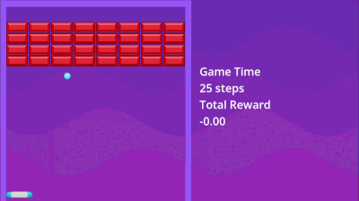
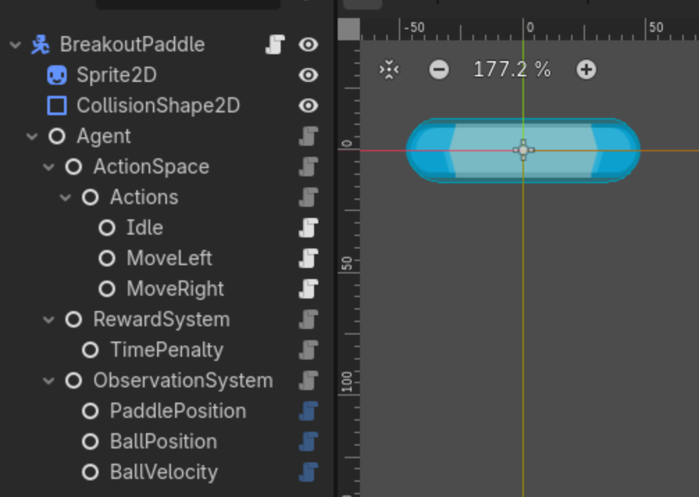
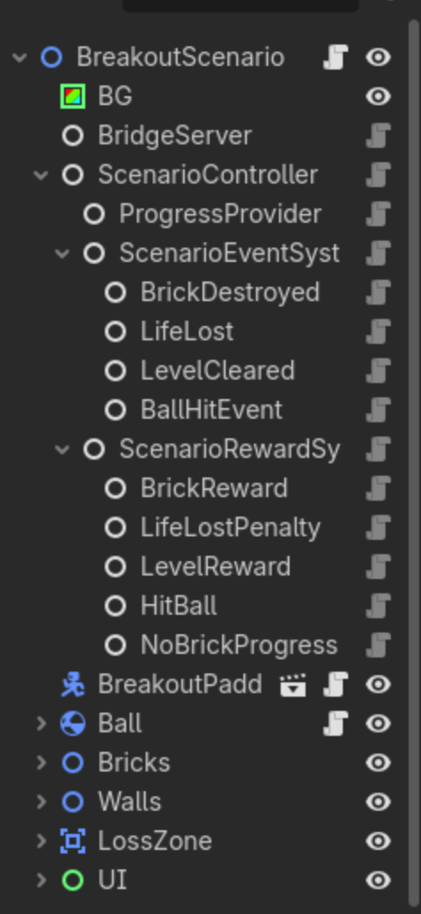
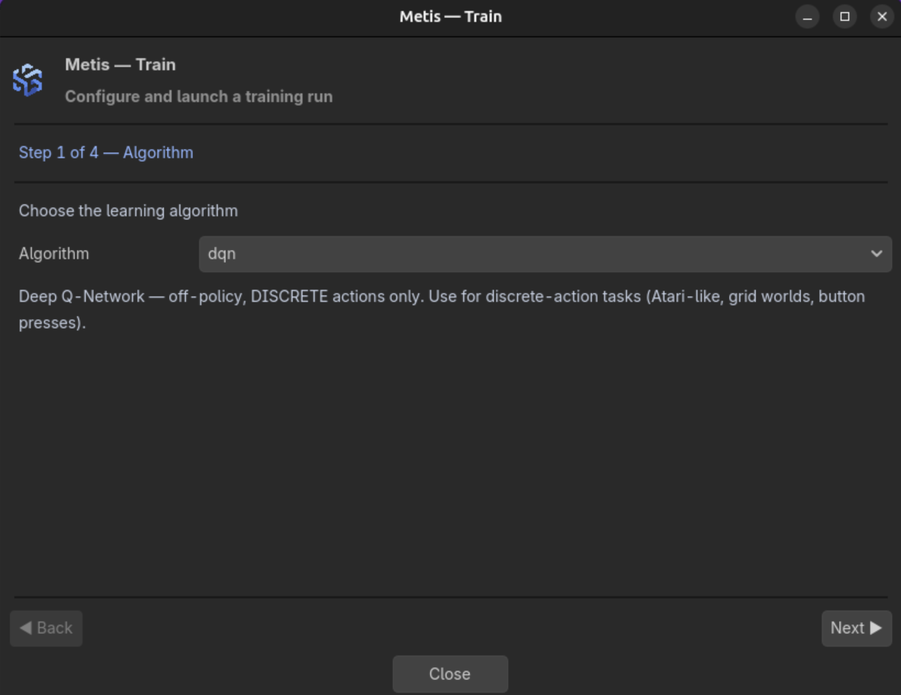
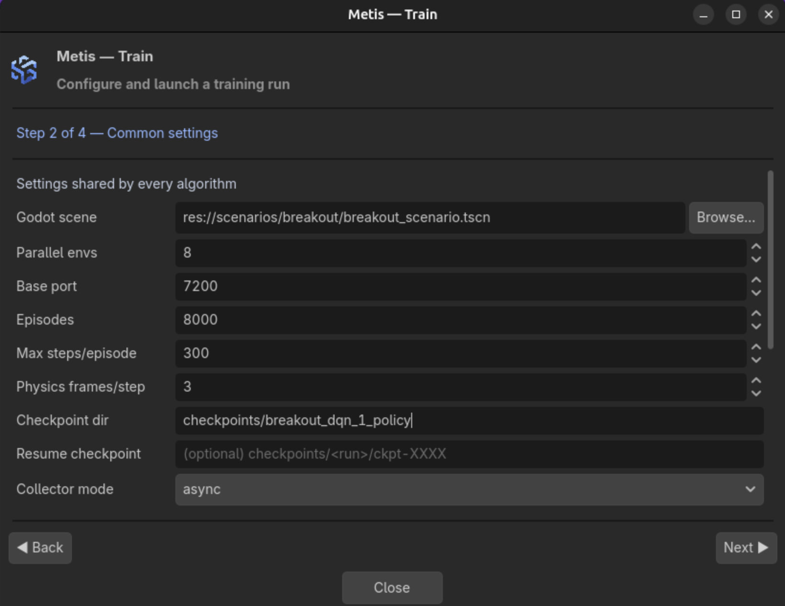
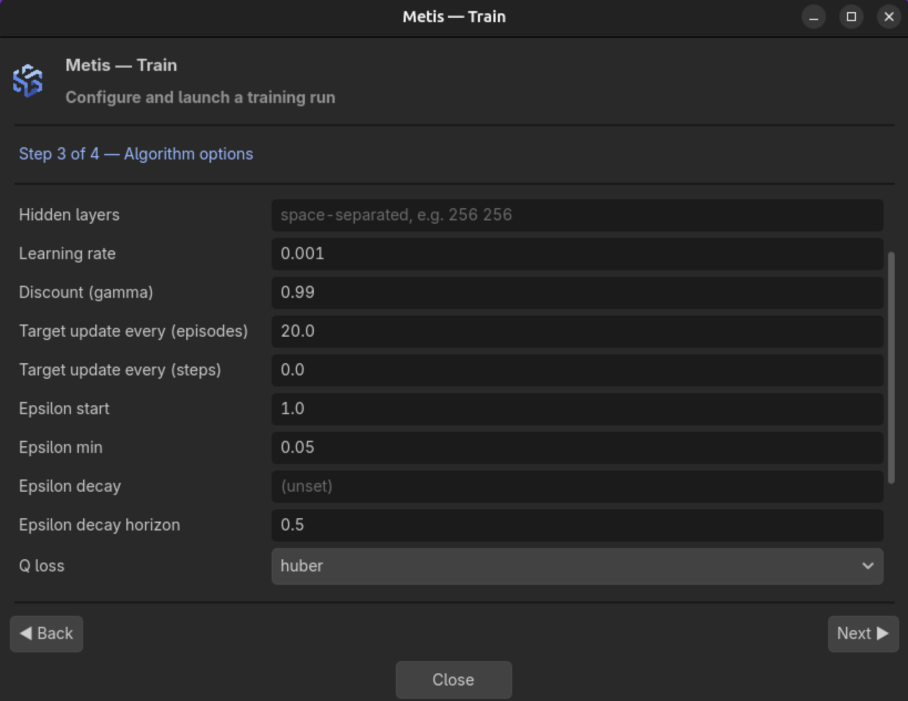

# Breakout from scratch

<div style="text-align:center"></div>

This tutorial builds a discrete single-agent task and explains why each part belongs to the paddle,
the scenario, or the physics engine. The finished example is in:

```text
godot/agents/BreakoutPaddle/
godot/scenarios/breakout/
```

Use those files as the reference implementation while following the steps.

A working policy clears the level in roughly 1600-2900 decisions. Several of the design choices
below exist because the obvious alternative produced a task that *looked* trainable and was not; each
of those is called out where it matters.

## 1. Define the learning problem

The paddle has three actions:

```text
0 idle
1 move_left
2 move_right
```

It observes five normalized values:

```text
paddle_x                   1
ball_relative_position     2
ball_velocity              2
```

The episode ends when the ball enters the loss zone or the last brick is destroyed. One life is one
episode: there is no multi-life game. That keeps credit assignment short, and it is what every
published Breakout agent does during training.

The reward is:

```text
time                -0.0001 per decision
ball_hit            +0.02
brick_destroyed     +1.0
level_cleared       +1.0
life_lost           -1.0
```

With 32 bricks the maximum return is 33.

**Keep every outcome inside +-1.** It is tempting to pay a big bonus for clearing the level, and it
does not work: a single step worth twenty times any other forces the value function to represent a
range it never needs, and with a squared error that one outlier dominates the update whenever it
occurs. The convention in the DQN literature is to clip rewards to `{-1, 0, +1}`, and the small
`ball_hit` term is the deliberate exception -- it is dense shaping that helps the early policy
discover paddle contact, and it is too small to make endless rallies preferable to breaking bricks.

The paddle does not observe which bricks remain. It can therefore learn to keep the ball alive and to
break bricks incidentally, but not to aim at a chosen target. That is a deliberate simplification;
adding brick state is the natural next exercise.

## 2. Why the ball is a `RigidBody2D`

The ball collides with walls, bricks, and the paddle through Godot physics. A `RigidBody2D` gives
collision response, continuous collision detection, contact signals, and a physical velocity that can
be observed.

Configure it with:

```text
gravity_scale = 0
can_sleep = false
continuous_cd = CAST_SHAPE
contact_monitor = true
max_contacts_reported >= 8
```

Use a physics material with high bounce and no friction. The scenario adjusts the post-collision
direction to keep the game arcade-like and to avoid nearly horizontal trajectories.

### Resetting a rigid body without leaking the previous episode

A rigid body's transform belongs to the physics server, not to the node. Assigning it and hoping is
the standard way to get a one-frame ghost, and in a Breakout reset that ghost is expensive: the
scenario re-enables every brick during the reset, so a ball still sitting where the last episode
ended has bricks materialise *around* it and reports contacts for them. The symptom is subtle -- each
episode after the first starts with one or two bricks already destroyed and a point or two of free
reward.

Move the body through the physics server so the change is visible in the same frame, and keep
`_integrate_forces()` as well, because velocity set anywhere else is overwritten by the solver:

```gdscript
extends RigidBody2D
class_name BreakoutBall

var _reset_pending := false
var _pending_transform := Transform2D.IDENTITY
var _pending_velocity := Vector2.ZERO


func reset_ball(reset_transform:Transform2D, launch_velocity:Vector2) -> void:
    _pending_transform = reset_transform
    _pending_velocity = launch_velocity
    _reset_pending = true
    freeze = false
    sleeping = false
    PhysicsServer2D.body_set_state(
        get_rid(), PhysicsServer2D.BODY_STATE_TRANSFORM, reset_transform)
    PhysicsServer2D.body_set_state(
        get_rid(), PhysicsServer2D.BODY_STATE_LINEAR_VELOCITY, launch_velocity)
    global_transform = reset_transform


func park_outside(somewhere:Vector2) -> void:
    _reset_pending = false
    freeze = false
    sleeping = false
    var parked := Transform2D(0.0, somewhere)
    PhysicsServer2D.body_set_state(get_rid(), PhysicsServer2D.BODY_STATE_TRANSFORM, parked)
    PhysicsServer2D.body_set_state(
        get_rid(), PhysicsServer2D.BODY_STATE_LINEAR_VELOCITY, Vector2.ZERO)
    global_transform = parked


func _integrate_forces(state:PhysicsDirectBodyState2D) -> void:
    if not _reset_pending:
        return
    state.transform = _pending_transform
    state.linear_velocity = _pending_velocity
    state.angular_velocity = 0.0
    _reset_pending = false
```

`park_outside()` is what the scenario calls *before* it restores the bricks. Whatever reappears
cannot collide with a ball that is no longer there.

Verify it with the reward of the first step of each episode: it must be exactly the time penalty,
`-0.0001`, on every episode and not only the first.

## 3. Build the paddle scene

```text
BreakoutPaddle              CharacterBody2D
|-- Sprite2D
|-- CollisionShape2D        CapsuleShape2D, rotated -90 degrees
`-- Agent
    |-- ActionSpace
    |   `-- Actions         DiscreteActionSet
    |       |-- Idle        DiscreteAction
    |       |-- MoveLeft    DiscreteAction
    |       `-- MoveRight   DiscreteAction
    |-- RewardSystem
    |   `-- TimePenalty     StepPenaltyReward
    `-- ObservationSystem
        |-- PaddlePosition  MethodObservationSource
        |-- BallPosition    MethodObservationSource
        `-- BallVelocity    MethodObservationSource
```



Configure the action nodes:


| Node      | `action_name` | `method_name` |
| --------- | ------------- | ------------- |
| Idle      | `idle`        | `stop`        |
| MoveLeft  | `move_left`   | `move_left`   |
| MoveRight | `move_right`  | `move_right`  |

Leave `target_path` empty; the default target is the paddle body. Do not also fill the legacy names
array or call `agent.add_action()` for the same actions.

The collision shape is a capsule rotated by -90 degrees, so its `height` is the paddle's **horizontal**
extent and its `radius` is the vertical one. Reading the wrong one is a factor-of-four error, and
section 8 depends on getting it right.

## 4. Implement paddle movement and observations

The full script is
[`breakout_paddle.gd`](../../godot/agents/BreakoutPaddle/breakout_paddle.gd). Its important behaviour:

```gdscript
func _physics_process(_delta:float) -> void:
    if not _training_active:
        return
    if manual_control:
        _move_input = Input.get_axis("move_left", "move_right")
    velocity = Vector2(_move_input * speed, 0.0)
    move_and_slide()
    if lock_vertical_position:
        global_position.y = _locked_y
        velocity.y = 0.0
    global_position.x = clampf(
        global_position.x,
        horizontal_center - horizontal_limit,
        horizontal_center + horizontal_limit)


func apply_action(action:Variant) -> Variant:
    if str(action) == "manual":
        return apply_manual_action()
    manual_control = false
    stop()
    var action_id := int(action)
    if agent.act(action_id) != OK:
        return 0
    return action_id
```

Locking `y` after `move_and_slide()` stops the ball from pushing the paddle vertically.

The observation methods return agent-relative, normalized values:

```gdscript
func get_paddle_x_observation() -> float:
    return clampf(
        (global_position.x - horizontal_center) / maxf(horizontal_limit, 0.001),
        -1.0,
        1.0)


func get_ball_relative_position_observation() -> Vector2:
    if ball == null:
        return Vector2.ZERO
    var relative := ball.global_position - global_position
    return Vector2(
        clampf(relative.x / observation_position_scale.x, -1.0, 1.0),
        clampf(relative.y / observation_position_scale.y, -1.0, 1.0))


func get_ball_velocity_observation() -> Vector2:
    if ball == null:
        return Vector2.ZERO
    return (ball.linear_velocity / observation_ball_speed_scale).clamp(
        Vector2(-1.0, -1.0),
        Vector2(1.0, 1.0))
```

Point the three `MethodObservationSource` nodes at these methods. Their combined size is five.

**Those `clampf` calls are a trap as much as a safety net.** If a scale is smaller than the range the
quantity actually spans, every value beyond it collapses onto the same `+-1` and the agent cannot tell
those states apart. A ball three quarters of the way up the screen then looks exactly like a ball at
the ceiling, and the policy has no sense of how long it has to react. Section 8 removes the guesswork
by deriving the scales from the scene instead of typing them.

`reset_all()` must clear movement, velocity, terminal state, physics interpolation, observation-source
caches, and local reward state. The repository script contains the complete implementation.

## 5. Build the scenario

```text
BreakoutScenario                    Node2D, breakout_scenario.gd
|-- BridgeServer
|-- ScenarioController
|   |-- ProgressProvider            MethodProgressProvider
|   |-- ScenarioEventSystem
|   |   |-- BrickDestroyed          ManualScenarioEventSource
|   |   |-- LifeLost                ManualScenarioEventSource
|   |   |-- LevelCleared            ManualScenarioEventSource
|   |   `-- BallHitEvent            ManualScenarioEventSource
|   `-- ScenarioRewardSystem
|       |-- BrickReward             EventScenarioReward
|       |-- LifeLostPenalty         EventScenarioReward
|       |-- LevelReward             EventScenarioReward
|       |-- HitBall                 EventScenarioReward
|       `-- NoBrickProgress         ProgressStallScenarioReward
|-- BreakoutPaddle                  BreakoutPaddle.tscn
|-- Ball                            BreakoutBall
|-- Bricks                          Node2D
|   `-- Brick01...Brick32           StaticBody2D, group brick
|-- Walls                           Node2D
|   |-- LeftWall / RightWall / Ceiling
|-- LossZone                        Area2D
`-- UI                              Control, optional on-screen counters
```


Set:

```text
BridgeServer.controller_path = ../ScenarioController
ScenarioController.controlled_agents = [../BreakoutPaddle]
ScenarioController.max_steps = 0
ScenarioController.randomize_reset = true
ScenarioController.reset_position_jitter = Vector3(0, 0, 0)
ProgressProvider.source_path = ../..
ProgressProvider.method_name = get_brick_progress
ProgressProvider.pass_agent_to_source = false
```

`reset_position_jitter` deserves a word, because it is measured in **pixels** and it applies to the
agent, not the ball. A non-zero value drops the paddle at a random column at the start of every
episode. Combined with a ball that is also placed randomly, the two offsets add up, and any sum
larger than the paddle can travel before the ball arrives is a life lost before the agent acts. Zero
here, and let the serve in section 7 provide the variety.

`max_steps = 0` leaves the episode length to the Python side, where it belongs: see section 11.

## 6. Configure events and rewards

```text
BrickDestroyed.event_name = brick_destroyed

LifeLost.event_name = life_lost
LifeLost.terminal_reason = life_lost

LevelCleared.event_name = level_cleared
LevelCleared.terminal_reason = level_cleared

BallHitEvent.event_name = ball_hit
```

```text
BrickReward.event_name = brick_destroyed
BrickReward.reward = 1.0
BrickReward.only_once = false

LifeLostPenalty.event_name = life_lost
LifeLostPenalty.reward = -1.0

LevelReward.event_name = level_cleared
LevelReward.reward = 1.0

HitBall.event_name = ball_hit
HitBall.reward = 0.02

NoBrickProgress.terminate_on_stalled_progress = true
NoBrickProgress.stalled_progress_window_steps = 5000
NoBrickProgress.stalled_progress_penalty = -5.0
```

The stall detector ends an episode that stops making progress. Keep its window **above** the episode
cap you train with, or it changes the task the moment you raise that cap -- and its penalty is far
outside the `+-1` range everything else lives in. Treat it as a backstop against a pathological
rally, not as a shaping term.

## 7. Serving the ball

The ball is served **off the paddle, upward**, with a random angle:

```gdscript
launch_direction = Vector2(
    rng.randf_range(-serve_horizontal_range, serve_horizontal_range),
    -1.0
).normalized()
reset_transform.origin = Vector2(
    _paddle_start.x,
    _paddle_start.y - _paddle_half_height() - _ball_radius - serve_gap)
```

```text
serve_from_paddle = true
serve_horizontal_range = 0.6      about 31 degrees either side of vertical
serve_gap = 6.0
```

This is the single most important choice in the scenario, and it is worth understanding why rather
than copying.

The obvious alternative is to drop the ball from a fixed point above the paddle. Do that and the
episode is decided before the agent can act: the ball reaches the paddle's line in a fraction of a
second, so any sideways offset larger than the paddle can cover in that time is a life lost no matter
what it does. Those episodes teach nothing except "you lost", and they are correlated with nothing the
policy controls -- pure labelled noise, and a large fraction of the data.

Serving from the paddle removes the opening offset by construction, and gives the agent a full round
trip -- up to the bricks and back, some forty decisions -- before the first interception. The
randomisation moves from **position** to **angle**, which produces different trajectories without
ever producing an impossible state.

The difference is measurable before any training. Drive the scene with uniformly random actions: with
a mid-air serve, episodes last a few dozen decisions; served off the paddle, they last around 150.

The paddle also controls the rebound angle. A centre hit sends the ball mostly upward, an edge hit
produces a diagonal:

```gdscript
func _apply_paddle_bounce(horizontal_offset:float) -> void:
    _set_ball_direction(Vector2(horizontal_offset, -1.0))
    ball_hit_event.trigger(str(paddle.name))


func _set_ball_direction(direction:Vector2) -> void:
    if direction.is_zero_approx():
        direction = Vector2(0.0, -1.0)
    var vertical_sign := signf(direction.y)
    if is_zero_approx(vertical_sign):
        vertical_sign = -1.0
    if absf(direction.y) < min_ball_vertical_ratio:
        direction.y = vertical_sign * min_ball_vertical_ratio
    ball.linear_velocity = direction.normalized() * _episode_ball_speed
    ball.angular_velocity = 0.0
```

`horizontal_offset` is the contact point divided by the paddle's half width, so the half width has to
be the real one. `min_ball_vertical_ratio` prevents long horizontal loops between the side walls.

For editor-only manual testing set `manual_control = true` and `auto_start_manual = true`. Save with
`manual_control = false` before training; the first action from Python also clears it defensively.

## 8. Calibrate from the geometry, do not type the numbers

Four values describe where the paddle may go and how the observations are scaled:

```text
paddle.horizontal_center
paddle.horizontal_limit
paddle.observation_position_scale
scenario.paddle_half_width
```

All four are in pixels, and all four are wrong the moment anyone moves a wall. Worse, they are wrong
**silently**: an observation scale that is too small clamps and hides distance; a travel limit that is
too wide maps positions the paddle can never occupy onto the ends of its own observation; a bounce
half width that is too large shrinks the agent's control over the rebound angle without any error
anywhere.

Measure them instead. The scenario reads the wall and loss-zone collision shapes at `_ready()`:

```gdscript
func _measure_field() -> void:
    var left := _shape_rect("Walls/LeftWall/CollisionShape2D")
    var right := _shape_rect("Walls/RightWall/CollisionShape2D")
    var ceiling := _shape_rect("Walls/Ceiling/CollisionShape2D")
    var loss := _shape_rect("LossZone/CollisionShape2D")
    _field = Rect2(
        Vector2(left.end.x, ceiling.end.y),
        Vector2(right.position.x - left.end.x, loss.position.y - ceiling.end.y))


func _calibrate_from_geometry() -> void:
    var half := _paddle_half_extent()
    paddle_half_width = half
    paddle.horizontal_center = _field.position.x + _field.size.x * 0.5
    paddle.horizontal_limit = maxf(1.0, _field.size.x * 0.5 - half)
    paddle.observation_position_scale = _field.size
```

Scaling the relative-position observation by the field size is what guarantees it never clamps: the
offset between ball and paddle cannot exceed the field they are both inside.

The scenario prints what it measured, so a wrong reading is visible on the first line of the log:

```text
Breakout field: x=[22, 660] y=[24, 721] paddle_half=47 limit=272
```

Set `auto_calibrate_from_geometry = false` if a scene needs the exported values instead.

## 9. Collision setup


| Object   | Layer | Mask |
| -------- | ----: | ---: |
| Ball     |     1 |    1 |
| Paddle   |     1 |    1 |
| Walls    |     1 |    1 |
| Bricks   |     1 |    1 |
| LossZone |     2 |    1 |

Every brick belongs to the `brick` group.

## 10. Validate before training

Set `GODOT_BIN` once:

```bash
export GODOT_BIN=/path/to/Godot_v4.7.1-stable_linux.x86_64
```

```bash
python/.venv/bin/python python/tools/random_rollout.py \
  --godot-bin "$GODOT_BIN" \
  --godot-project godot \
  --godot-scene res://scenarios/breakout/breakout_scenario.tscn \
  --steps 200 \
  --print-reward-terms \
  --no-headless
```

Expected contract:

```text
action_type=discrete
obs_shape=(5,)
num_actions=3
```

Check that:

1. The first step of **every** episode returns only the time penalty. Anything larger means the
   bricks are being restored around a stale ball.
2. No observation ever reaches exactly `+-1` except `paddle_x`, which legitimately does when the
   paddle is against a wall. A ball observation pinned at `+-1` means a scale is too small.
3. Identical seeds reproduce the serve; different seeds change its angle.
4. One brick hit emits one `brick_destroyed` event.
5. The loss zone returns `terminal_reason=life_lost`, the last brick `terminal_reason=level_cleared`.
6. Ball speed stays close to the configured episode speed.
7. Different paddle contact points change the rebound direction.
8. The ball freezes while Python is not advancing the environment.
9. No observation is `NaN`.
10. With uniformly random actions, episodes last on the order of a hundred decisions. A handful means
    the start of the episode is not winnable.

Point 10 is the cheapest sanity check in the list and the one that catches the most: it costs a
minute and it measures whether the task is answerable at all, before any learning is involved.

## 11. Train with DQN

```bash
python/.venv/bin/python python/train.py \
  --algorithm dqn \
  --godot-bin "$GODOT_BIN" \
  --godot-project godot \
  --godot-scene res://scenarios/breakout/breakout_scenario.tscn \
  --num-envs 8 \
  --num-episodes 8000 \
  --max-steps-per-episode 4000 \
  --physics-frames-per-step 3 \
  --batch-size 256 \
  --replay-warmup 20000 \
  --collector-mode async \
  --async-update-every 4 \
  --grad-clip-norm 10 \
  --critic-loss huber \
  --target-update-steps 10000 \
  --best-metric reward_mean \
  --checkpoint-dir checkpoints/breakout_dqn \
  --dashboard \
  --headless
```

Four of those deserve an explanation.

**`--max-steps-per-episode` decides whether the goal exists.** A round trip from the paddle to the
bricks and back is about forty decisions, so clearing thirty-two bricks cannot happen in fewer than
roughly fifteen hundred. Set the cap below that and `level_cleared` never fires: the reward is dead,
and every evaluation reports failure for episodes that were about to succeed. A competent policy here
needs 1600-2900 decisions, so 4000 leaves room without doubling the length of the run.

**`--target-update-steps` counts transitions, `--target-update-every` counts episodes.** Episodes are
a moving unit on this task: they grow from around fifty decisions to nine hundred as the policy
improves, which silently drags the real interval between target refreshes from a few hundred gradient
updates to several thousand. Counting transitions pins it where you set it, which is what the DQN
literature does.

**`--critic-loss huber`** is a departure from the default, which is `mse`. Huber is quadratic within
`--huber-delta` and linear outside it, so one large temporal-difference error cannot dominate an
update the way a squared error lets it. It is the classic DQN choice, and it only makes sense
alongside the clipped rewards of section 1: an outcome whose magnitude far exceeds the delta is
effectively ranked rather than fitted, so pairing Huber with a large one-off bonus leaves that bonus
unlearned. The two settings travel together or not at all.

Treat this one as a reasoned default rather than a measured one. The configuration in this command is
the one that produced the results quoted at the top of the page; what has not been run here is a
controlled `mse`-versus-`huber` comparison with everything else held fixed. If you want that answer
for your own task, change only this flag and train from scratch -- resuming makes the two runs
incomparable.

**`--async-update-every 4`** means one gradient update per four transitions. That is the classic DQN
ratio, and the default.

**`--grad-clip-norm 10`** is also a departure: DQN ships with clipping off, while the continuous-action
learners default to 10 because they diverged to NaN without it. Nothing here needs it in the same
urgent way, but a hard cap on the gradient norm costs nothing and removes one way for a run to end in
a wall of `nan`.

**`--best-metric reward_mean`** picks the checkpoint to keep. The default, `auto`, ranks candidates
lexicographically by success first, which is designed for sparse tasks where reward says little.
Here reward tracks destroyed bricks almost one for one, so it is the more informative signal --
especially early, when no episode has cleared the level yet and a success-first ordering has nothing
to compare.

Use one visible preview without rendering every environment:

```text
--no-headless --render-env-count 1 --render-mode light-gpu
```

Rendered instances run at display rate, so throughput is not comparable with a headless run.

Resume the same run with the same checkpoint directory and `--resume`, raising `--num-episodes` to the
new final episode number.

You can also use the Graphical Interface from Godot Editor, using the buttons near the normal Run Scene Button:
 \
 \


### Optional SB3 comparison

To run the same Godot task through Stable-Baselines3 DQN, use the separate SB3 environment:

```bash
python/.venv-sb3/bin/python python/train.py \
  --backend sb3 \
  --algorithm dqn \
  --godot-bin "$GODOT_BIN" \
  --godot-project godot \
  --godot-scene res://scenarios/breakout/breakout_scenario.tscn \
  --num-envs 8 \
  --total-timesteps 250000 \
  --max-steps-per-episode 4000 \
  --physics-frames-per-step 3 \
  --batch-size 256 \
  --learning-starts 5000 \
  --buffer-size 200000 \
  --collector-mode sync \
  --evaluation-episodes 20 \
  --checkpoint-dir checkpoints/breakout_sb3_dqn \
  --headless
```

For the comparison to mean anything the two commands must describe the same task: the same episode
cap, the same physics rate, the same scene. SB3 writes `.zip` models and its own replay format, and
it does not support the Metis async collector, best-policy workflow, Keras artifacts, or
demonstration-aware trainers.

## 12. Run and evaluate the policy

```bash
python/.venv/bin/python python/run.py \
  --algorithm dqn \
  --checkpoint-dir checkpoints/breakout_dqn/best \
  --load-from checkpoint \
  --godot-bin "$GODOT_BIN" \
  --godot-project godot \
  --godot-scene res://scenarios/breakout/breakout_scenario.tscn \
  --physics-frames-per-step 3 \
  --episodes 20 \
  --max-steps 0 --no-time-limit \
  --epsilon 0.0 \
  --no-headless
```

Three of those arguments are easy to get wrong, and all three make a good policy look broken.

**`--physics-frames-per-step` defaults to 1 and training used 3.** Leave it out and the policy runs at
three times the control rate it learned on. It will still play; it will play badly, and nothing in the
output says why.

**`--load-from checkpoint`.** With `auto`, a stray weights file in the working directory is preferred
over the `--checkpoint-dir` you passed.

**`--max-steps 0 --no-time-limit`.** Evaluating with a cap below what the task needs turns wins into
truncations.

For continuous viewing:

```text
--infinite --no-time-limit --execution-mode realtime --no-headless
```

`realtime` matters for watching: lockstep pauses the scene between decisions and reads as stuttering.

## 13. Read the numbers correctly

The trainer writes a frozen, epsilon-zero evaluation into
`checkpoints/<run>/evaluations/eval-*.json`. Three things about it are worth knowing before drawing
conclusions.

**`progress_mean` is averaged over the steps of the episode, not the value at the end.** Progress
climbs from zero to one, so its time average lands near half its final value. The field you want when
you mean "fraction of bricks destroyed" is `progress_final`, in the per-episode records.

**`success_rate` is bounded by the episode cap.** An episode truncated one brick short counts exactly
like an episode that lost the ball immediately. If successes cluster just under the cap, raise it
before concluding anything about the policy.

**A peak is not a result.** Twenty-episode evaluations are noisy, and a run that touches a high
success rate once while sitting far below it either side has not learned the task. Track the mean
absolute change between consecutive evaluations alongside the best value; a modest best with small
swings is a better recipe than a high best that does not reproduce.

Record level-clear rate, mean bricks destroyed, episode length, and loss rate over fixed seeds.
Training reward includes exploratory actions and is not an evaluation score.

## 14. Randomization and what to change next

The serve angle is the only randomisation the base task needs, and it is enough: it changes every
trajectory without ever making an episode unwinnable.

When you extend it, change one source of difficulty at a time, and restart from scratch rather than
resuming -- a warm start makes two configurations incomparable. Reasonable next steps, roughly in
order of value:

- **Brick state in the observation.** A remaining-bricks scalar lets the value function tell the start
  of a level from its end; a per-brick occupancy grid is what a policy would need to aim.
- **Ball speed and paddle width.** Both change the timing budget rather than the structure.
- **Brick layouts.** Draw them from the reset seed so an episode stays reproducible.

Every random choice must come from the episode's reset seed. A scenario that cannot replay an episode
from its seed cannot be debugged.
