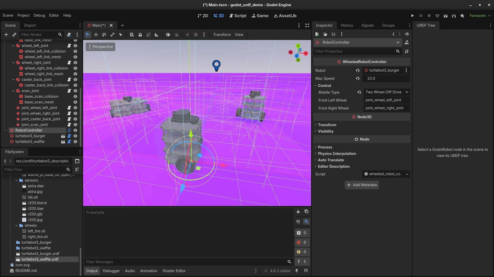
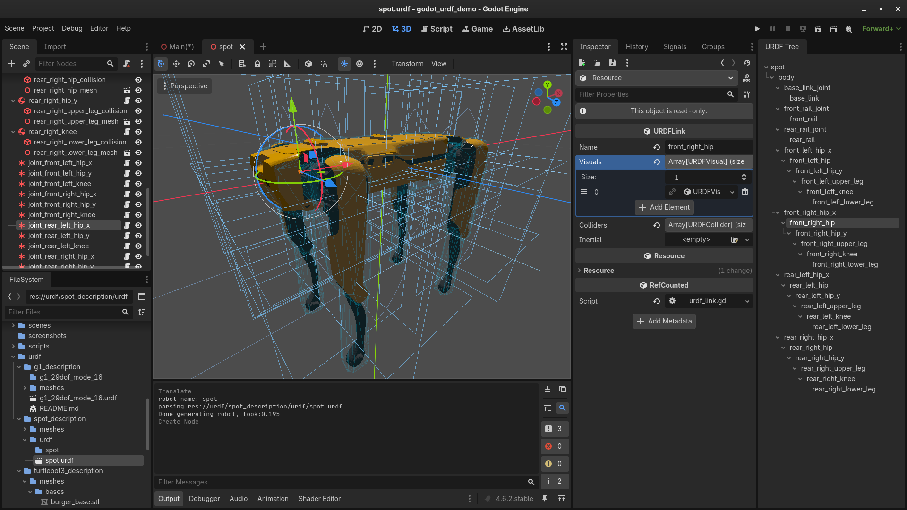
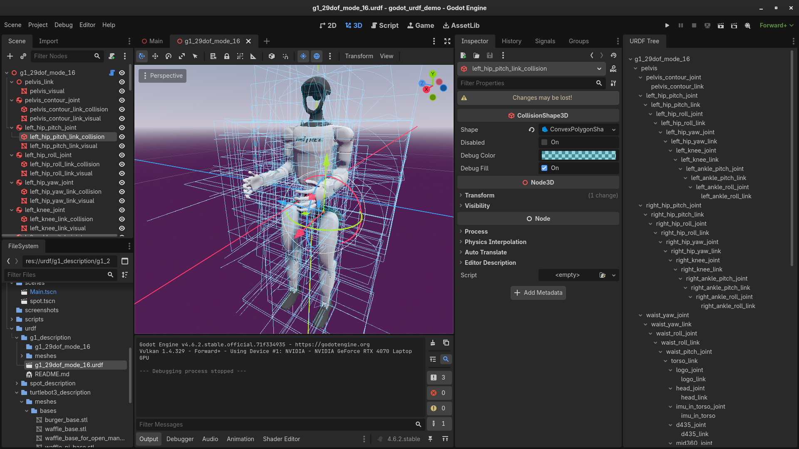

# Godot URDF Addon
URDF parser for Godot 4.6 using the native XML-parser.

## Features / Usage
Simply Drag-and-Drop URDF-files in your Godot scene, visuals and collisions will be generated automatically. Alternatively you can attach the urdf_loader.gd-script to a Node3D and the robots nodes will be created at its children, so you can easily modify/extend your robot.

This repository provides a controller for wheeled robots, you only need to configure the movement type (e.g. Differential drive) and the generated 6DOF-Joints of the wheels and can control the robot using the W A S D keys.

## Demo

You can see the addon in action in [this demo repository](https://github.com/brean/godot_urdf_demo) with turtlebot and Boston Dynamics Spot robot.

The plugin has also been tested with a modified version of the Unitree G1 Humanoid and additional Robots by the [DFKI Robotics Innovation Center](https://dfki.de/robotics). Additional Demos will be provided soon.

## Technical details
The collisions are represented as CollisionShape3D which are children of generated RigidBody3D, next to Generic6DOFJoint3D. This flattens the XML structure, so we also provide a custom dock that shows the original structure as tree.

## Screenshots / Examples
### Driving around

Fig. 1: The main Scene with the controllable turtlebot in the front. Note that the original URDF for the Turtlebot 3 defines the caster wheel in the back as box, a sphere would be more realistic.

### Importing a quadruped

Fig 2: The imported Spot Robot from Boston Dynamics (with custom configured collision meshes). Note that it is missing a controller so the robot will just collapse in on itself when you put it on any surface.

### Importing a humanoid

Fig 3: The imported Unitree G1 Robot.

## Recommendation
Use this URDF-parser in combination with godot-stl-io by @onze, [MIT license](https://github.com/onze/godot-stl-io/blob/development/addons/stl-io/license.txt): https://github.com/onze/godot-stl-io/ to load URDFs that reference STL-files.